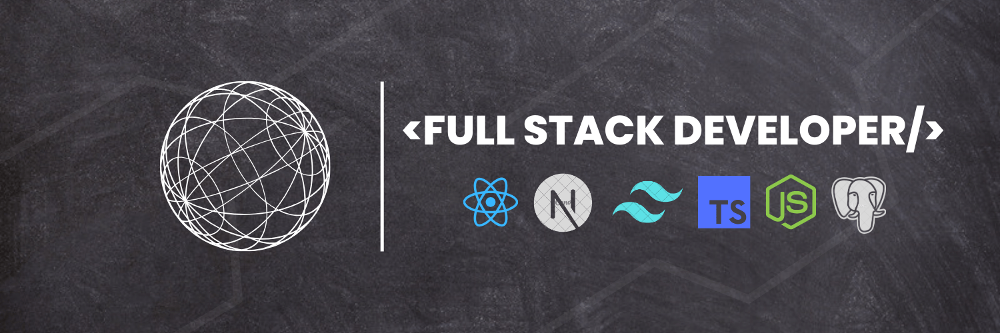

👋 Hello, I'm Ayush, a passionate full stack developer with a focus on building robust web applications using React and Spring Boot. With a blend of frontend and backend expertise, I thrive on crafting seamless user experiences while ensuring efficient data management and security on the server side

🚀 On my GitHub, you'll find a collection of projects showcasing my skills and experience. From single-page applications powered by React to RESTful APIs and microservices developed with Spring Boot, each repository reflects my commitment to clean code, modular architecture, and continuous improvement.

🔧 Whether I'm debugging complex frontend logic or optimizing backend performance, I approach every challenge with curiosity and determination. I'm passionate about collaborating with like-minded developers, contributing to projects, and sharing knowledge within the tech community.

📫 Interested in discussing potential collaborations or opportunities? Feel free to reach out via email ayushagarwal.dev@gmail.com or connect with me on LinkedIn. Let's build something amazing together!

 

## 💼 Programming Languages and Tools:

 

<!--  -->

<!-- 
 -->

 

## 📈 GitHub Stats

 

